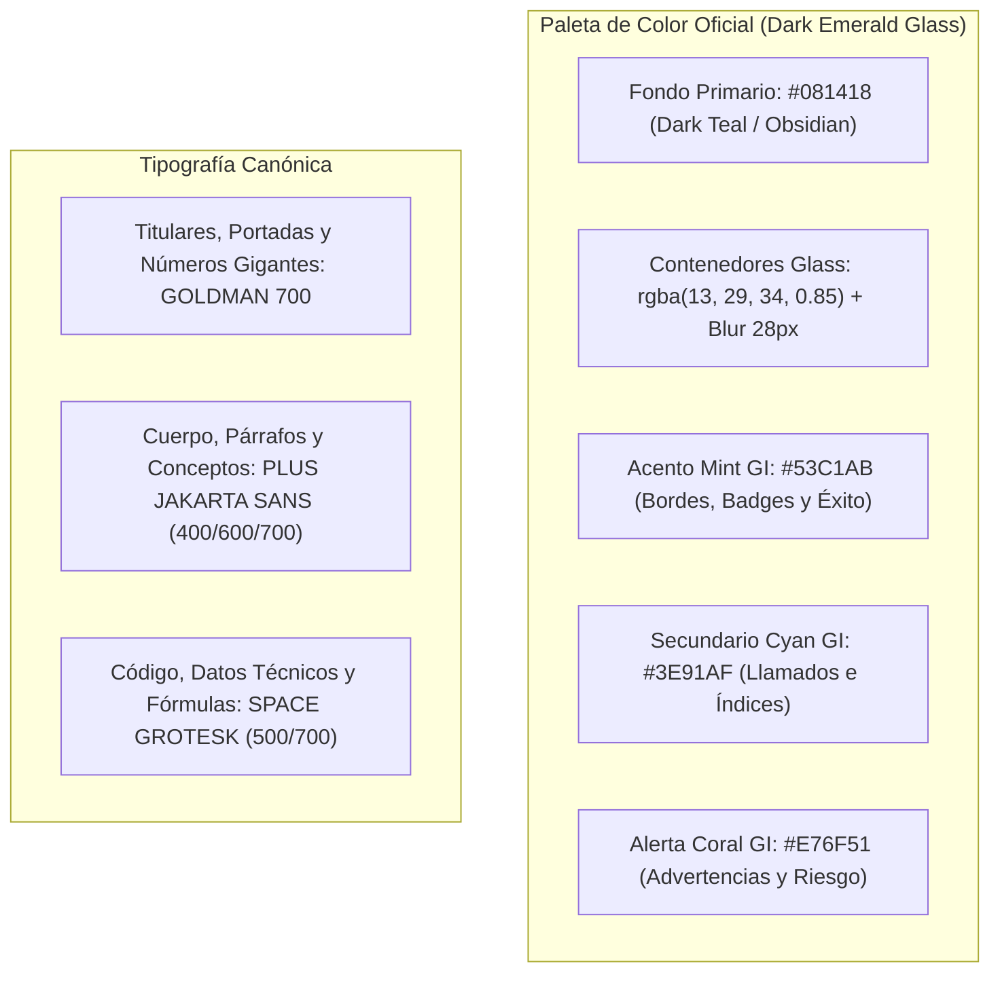

# Gobernanza y Estándar de Producción: Guías Educativas y Material de Captación
<!-- ambito: ambos -->
**Grupo Inteligencia SpA · Área de Post Venta y Análisis de Mercado**  
*Fecha de Entrada en Vigor: 10 de Septiembre de 2026*  
*Documento de Control y Contrato de Calidad Editorial e Institucional*

---

> [!CRITICAL]
> **PROPÓSITO Y OBLIGATORIEDAD DE ESTE ESTÁNDAR:**  
> Este documento establece los requisitos mínimos, no negociables y auditables para la creación, maquetación, revisión y distribución de todo **Lead Magnet, Guía Táctica, Manual Operativo o Material Educativo** generado por el Área de Post Venta y utilizado por el Área de Marketing en campañas de adquisición (Meta Ads, Google Ads o distribución orgánica).
> 
> Ningún material educativo puede publicarse, pautarse o distribuirse a prospectos si no cumple con el 100% de los guardrails de este estándar.

---

## 1. Guardrails Críticos Inquebrantables

### REGLA 1: CERO BLUR / PROHIBICIÓN TOTAL DE GATING INTERNO (REGLA ANTI-BLUR)
Queda **estrictamente prohibido** difuminar (*blur*), tachar, ocultar o bloquear páginas o secciones dentro de una guía educativa para exigir aperturas de cuenta, depósitos o registros posteriores.
* **El principio**: El usuario ya pagó el costo acordado al entregar su Nombre, Email y WhatsApp en el formulario de captación. Cualquier barrera secundaria dentro del archivo constituye una violación a la *Teoría de la Reactancia Psicológica (Brehm, 1966)* y al *Efecto de Disconfirmación de Expectativas (Oliver, 1980)*, destruyendo la confianza fiduciaria.
* **El mandato**: Si una guía promete explicar el USD/CLP, el Nasdaq o el Oro, debe entregarse **100% íntegra, legible y terminada** desde la primera hasta la última página.

### REGLA 2: CERO HARDCODING DE COTIZACIONES Y NIVELES (REGLA DE INTEGRIDAD MT5)
Queda **estrictamente prohibido** escribir precios, cotizaciones, niveles de soporte/resistencia o variaciones porcentuales "a mano" o calculadas mentalmente en los gráficos o tablas de las guías.
* Todo gráfico técnico incluido en una guía DEBE generarse obligatoriamente mediante el pipeline oficial de MetaTrader 5 (`serie_mt5.py` + `story_grafico.py` / `grafico_informe.py`), utilizando exactamente **60 velas en temporalidad H1**.
* Todo nivel numérico debe respetar la **tabla de decimales (`digits`) de `CLAUDE.md`** y `config/activos.json`:
  * `USDCLP`: 2 decimales (ej. `931.50`).
  * `XAUUSD`: 2 decimales (ej. `2512.40`).
  * `COPPER`: 4 decimales (ej. `4.1250`).
  * `US100.spot`: 2 decimales (ej. `19850.20`).
* Prohibición absoluta de "gráficos mudos": Todo gráfico DEBE incluir sus líneas horizontales de soporte, resistencia y precio spot actual con etiquetas numéricas legibles.

### REGLA 3: PROHIBICIÓN TOTAL DE MODELOS DE DIFUSIÓN (REGLA 0)
Queda terminantemente prohibido el uso de herramientas de IA generativa text-to-image (`generate_image`, Midjourney, DALL-E) para ilustrar mercados, gráficos financieros, terminales o pantallas de cotizaciones. Toda pieza gráfica es código reproducible: **HTML + SVG vectorial + CSS renderizado a 300 DPI vía Playwright/Chromium**.

### REGLA 4: COMPOSICIÓN PEDAGÓGICA EN 3 CAPAS
Todo concepto técnico, fenómeno macroeconómico o estrategia operativa explicada en una guía debe redactarse obligatoriamente bajo la **arquitectura pedagógica de 3 capas**:
1. **Capa 1: Qué es y qué pasa (El Hecho Técnico)**: Definición precisa y cuantitativa del activo o fenómeno (ej. diferencial de tasas BCCh vs. Fed, inventarios de cobre en Shanghái).
2. **Capa 2: Qué significa (Impacto Ciudadano Real)**: Explicación en lenguaje claro, accesible para cualquier novato en menos de 30 segundos, sin jerga pretenciosa (ej. cómo esto empuja el precio de la bencina o la apreciación del peso chileno).
3. **Capa 3: Qué NO hacer y Gestión de Riesgo (La Regla del 1%)**: La advertencia estricta de control de drawdown. Prohibido hablar de una oportunidad de mercado sin explicar el cálculo exacto del tamaño de la posición (*lotaje*) y la colocación del Stop Loss para no arriesgar más del 1% del capital.

### REGLA 5: BLINDAJE REGULATORIO Y COMPLIANCE PUBLICITARIO
Toda guía debe estar blindada ante las normativas chilenas de la CMF y las políticas de *Financial Products & Services* de Meta Ads:
* **Cero promesas de rentabilidad**: Prohibido insinuar ganancias fijas, porcentajes asegurados o "libertad financiera".
* **Cero lenguaje de casino**: Prohibidas palabras como *"apuesta"*, *"disparo seguro"*, *"dato infalible"*, *"señal ganadora"*.
* **Disclaimer Regulatorio Obligatorio**: Toda contraportada debe incluir el disclaimer legal canónico:
  > *"Material estrictamente educativo y de análisis técnico intermercado. Grupo Inteligencia SpA no realiza recomendaciones individuales de compra o venta ni administra fondos de terceros. Operar derivados financieros y apalancamiento conlleva un alto nivel de riesgo de pérdida de capital."*

---

## 2. Estándar Visual y Tipográfico (Brandkit Canónico)

Toda guía educativa producida por Post Venta debe construirse bajo el sistema de diseño oficial de Grupo Inteligencia:

### Reglas de Formato y Legibilidad Universal (Low-Vision Friendly)
* **Formato de Maquetación**: Documento vertical estándar A4 o Carta a **300 DPI**, exportado a PDF con hipervínculos funcionales.
* **Escala de Texto Mínima**:
  * Titulares de Módulo: **32pt a 42pt** (Goldman 700).
  * Subtítulos y Secciones: **18pt a 22pt** (Plus Jakarta Sans 700).
  * Cuerpo de lectura: **11pt a 13pt** (Plus Jakarta Sans 400/500), con interlineado mínimo de `1.45`.
  * Prohibido texto menor a 9pt, excepto en notas legales al pie.
* **Contraste Obligatorio**: Texto sobre fondo oscuro en blanco puro (`#FFFFFF`) o blanco humo (`#F0F4F8`). Prohibido usar grises de bajo contraste sobre fondos oscuros.

---

## 3. Principios de Ergonomía Cognitiva, Atención Visual y Arquitectura de Página

Todo material educativo y de captación debe diseñarse no solo bajo criterios estéticos, sino bajo fundamentos de psicología cognitiva y usabilidad documental (*Information Design*):

### A. Gestión de Carga Cognitiva y Chunking (*Sweller, 1988 · Miller, 1956*)
* **Máximo 3 a 4 bloques por página**: La memoria de trabajo humana procesa eficazmente $4 \pm 1$ elementos independientes. Saturar una página con más de 4 bloques inconexos provoca parálisis por análisis y abandono de lectura.
* **Composición en 3 Capas Obligatoria**: Todo concepto complejo se desglosa en: 1) El Hecho Técnico (cuantitativo), 2) El Impacto Ciudadano (economía real en <30 segundos), y 3) Qué NO hacer / Gestión de Riesgo (regla del 1%).

### B. Patrón de Escaneo Visual y Puntos de Fijación (*Nielsen, 2006 · Pernice, 2017*)
* En entornos digitales y lectura en pantalla, los ojos del usuario siguen un patrón en **F** (lectura analítica) o en **Z** (comparación de opciones).
* **Posición del BLUF (Bottom Line Up Front)**: La conclusión operativa, el nivel clave o el hallazgo principal debe ubicarse siempre en el primer tercio superior izquierdo de la página. Los gráficos de soporte deben acompañar la dirección natural de la vista, nunca forzar regresiones visuales erráticas.

### C. Ratio Datos-Tinta (*Data-Ink Ratio, Edward Tufte, 1983*)
* Toda tinta o píxel debe portar significado. Queda prohibido el "chartjunk" (decoraciones vacías, tramas recargadas o sombras excesivas que resten claridad al dato).
* **Desacoplamiento de Roles**: Si un diagrama vectorial convive con una tabla o con viñetas explicativas, el diagrama debe transmitir la **tendencia, la relación espacial o el flujo**, mientras que la tabla provee la **precisión métrica**. Prohibido duplicar textos extensos dentro del dibujo vectorial que saturen el lienzo.

### D. Estándar de Legibilidad al 100% Sin Zoom (*No-Zoom Standard*)
* En visualización normal (escala 100% en monitor o lectura en soporte A4), **ningún texto dentro de un gráfico, diagrama SVG o tabla puede tener un tamaño efectivo inferior a 9.5pt a 10pt**.
* **Proporciones Nativas Vectoriales**: Prohibido utilizar lienzos SVG con anchos artificiales desmedidos que fuercen factores de reducción superiores al 40% al insertarse en el ancho útil de página ($182\text{ mm} \approx 688\text{ px}$). Todo gráfico debe diseñarse con dimensiones y márgenes calibrados a su contenedor.

### E. Presupuesto Estricto de Página (*Page Budgeting & Autocontención*)
* **1 Página = 1 Unidad Conceptual Cerrada**: Cada página A4 debe iniciar y culminar su tema de forma íntegra.
* **Prohibición de Líneas Huérfanas y Vacíos Desproporcionados**: Queda prohibido que 1 o 2 líneas de cierre se desborden a una página vacía, o que una página contenga menos del 60% de su altura útil cubierta sin justificación de diseño. Cada página debe calibrarse midiendo su altura útil en Chromium ($1.017\text{ px}$ útiles entre márgenes de $14\text{ mm}$).

### F. Delimitación Metodológica de Valores Económicos (Costos Referenciales)
* Toda mención de presupuestos publicitarios, costos por lead (CPL), costos de adquisición (CAC) o proyecciones de ahorro debe explicitar formalmente su carácter de **simulación econométrica referencial (*ceteris paribus*)**.
* El Área de Post Venta no fija ni administra presupuestos de pauta; el modelado numérico tiene por único objetivo demostrar la ganancia técnica de eficiencia por remoción de fricción en la experiencia de usuario.

---

## 4. Gobernanza del Personaje Institucional ("Víctor")

Para evitar la penalización por simulación artificial demostrada por *Luo et al. (Marketing Science, 2019)*, la participación del personaje institucional queda estrictamente normada:

| Entorno / Canal | ¿Permitido usar a Víctor? | Rol y Frontera de Actuación |
|---|:---:|---|
| **Dentro de la Guía (PDF)** | **SÍ (Rol Principal)** | Aparece como **el anfitrión pedagógico y autor editorial** (*"Víctor te guía para calcular tu riesgo"*). Humaniza la lectura y refuerza el lema corporativo. |
| **Anuncios de Meta Ads** | **CONDICIONAL** | Puede aparecer como elemento visual secundario o relator, pero **el foco visual debe ser siempre el gráfico MT5 real y el dato de mercado**, nunca una caricatura aislada. |
| **Formulario Nativo de Meta** | **NO** | El formulario de captación es 100% sobrio e institucional bajo el sello corporativo de Grupo Inteligencia. |
| **WhatsApp de Entrega / Chat** | **PROHIBIDO EN PRIMERA PERSONA** | El bot de WhatsApp **jamás debe decir "Hola, soy Víctor"**. Debe firmar transparentemente como *"Mesa de Análisis · Grupo Inteligencia"*, evitando la decepción del usuario al interactuar con un humano real. |

---

## 5. Gobernanza de las Mesas Técnicas Especializadas

Las sesiones en vivo dictadas por Post Venta como herramienta de apalancamiento comercial (*Sales Enablement*) deben regirse por el siguiente protocolo:

### A. Tríada de Especialización Temática
Queda prohibido dictar webinars generalistas difusos. Cada sesión debe tener un activo central único:
* **Martes 19:30 hrs**: *Clínica Táctica USD/CLP: Correlación Cobre, Fed y Niveles H1*.
* **Miércoles 19:30 hrs**: *Mesa Técnica Wall Street: Nasdaq 100, Valuación y Big Tech*.
* **Jueves 19:30 hrs**: *Mesa Técnica Oro: Cobertura Macro, Tasas Reales y Geopolítica*.

### B. Cronograma y Estructura en Vivo (40 Minutos Estrictos)
1. **00 - 05 min**: Bienvenida institucional, lema corporativo y advertencia de riesgo.
2. **05 - 25 min (20 min)**: Análisis cuantitativo en vivo sobre terminal MT5 (sin diapositivas de relleno, gráficos reales en pantalla).
3. **25 - 35 min (10 min)**: Aplicación matemática de la fórmula de lotaje al 1% de riesgo.
4. **35 - 40 min (5 min)**: Pase comercial elegante:
   > *"Quienes deseen aplicar este protocolo con el acompañamiento de nuestros analistas, mañana su asesor asignado los contactará para entregarles la plantilla de cálculo configurada."*

---

## 6. Protocolo de Calidad Pre-Publicación (Checklist de Salida / DoD)

Antes de entregar una guía educativa a Marketing para su pauta en Meta Ads, el Director de Post Venta debe validar los siguientes 10 puntos de control:

- [ ] **1. Prueba Anti-Blur**: El documento se lee 100% fluido desde la portada hasta la contraportada sin ninguna página bloqueada o difuminada.
- [ ] **2. Integridad MT5**: Todos los gráficos fueron exportados desde MT5 en H1 (60 velas) con niveles visibles y precios de ejecución reales (cero hardcoding).
- [ ] **3. Tabla de Decimales**: Los precios cumplen estrictamente con los `digits` oficiales del activo.
- [ ] **4. Regla de las 3 Capas**: Cada módulo explica el hecho técnico, el impacto ciudadano y la regla de no-hacer/gestión de riesgo.
- [ ] **5. Fórmula del 1%**: La guía contiene el procedimiento matemático explícito para calcular el tamaño de posición por volatilidad.
- [ ] **6. Estándar Sin Zoom (No-Zoom Standard)**: Ningún texto en gráficos SVG o tablas es inferior a 9.5pt a 10pt efectivos en escala 100%.
- [ ] **7. Page Budgeting Autocontenido**: Cada página A4 constituye una unidad conceptual cerrada, con altura medida en Chromium (<1.017px) y cero líneas huérfanas.
- [ ] **8. Delimitación de Costos Referenciales**: Las cifras financieras declaran formalmente su condición de modelo econométrico referencial.
- [ ] **9. Compliance y Advertencia de Riesgo**: Contiene el disclaimer regulatorio visible en la contraportada y no incluye promesas de ganancia.
- [ ] **10. Brandkit y Calibración de Víctor**: Utiliza exclusivamente las fuentes Goldman, Plus Jakarta Sans y Space Grotesk, paleta Dark Emerald Glass y Víctor en rol pedagógico institucional.

---
*Aprobado por el Área de Post Venta y Análisis de Mercado · Grupo Inteligencia SpA.*
