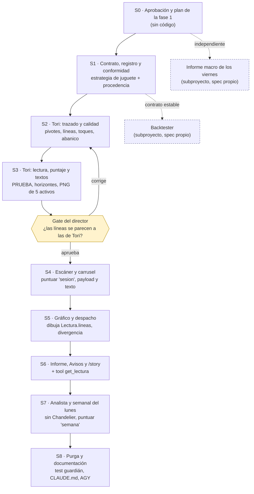

# Enchufe de estrategia: mapa de sesiones

Spec: `docs/superpowers/specs/2026-10-09-enchufe-estrategia-design.md`. Doctrina:
`docs/metodologia-tendencias.md`.

Las cuatro fases del spec (§7) se parten en **nueve sesiones**, cada una con su rama y su PR. Una
sesión no empieza hasta que la anterior de su cadena está **mergeada en master**, porque cada una
construye sobre el código de la otra. Ninguna sesión deja el sistema con dos lecturas a la vez:
mientras el carrusel no se conecte (S4), la estrategia nueva existe pero nadie la consume.

| Fase del spec | Sesiones | Plan que la guía |
|---|---|---|
| 1. Contrato y Tori, sin consumidores | S1, S2, S3 | Lo escribe S0 |
| 2. Escáner, carrusel y despacho | S4, S5 | Lo escribe el inicio de S4 |
| 3. Informe, Avisos, analista y resto | S6, S7 | Lo escribe el inicio de S6 |
| 4. Purga y documentación | S8 | Lo escribe el inicio de S8 |

Cada plan de fase se escribe **con el código de la fase anterior ya en master**, no ahora: un plan
de la fase 3 escrito hoy describiría funciones que todavía no existen.

---

## Reglas para todas las sesiones

- **Rama propia desde master**, con un nombre como `feat/enchufe-s<N>-<tema>`. Nunca se trabaja en master.
- **Se commitea con `git add` explícito, nunca con `-a`.** El árbol suele tener cambios ajenos
  (`data central/`, bitácoras).
- **TDD:** el test va primero y la suite completa queda verde antes del PR (`uv run pytest`).
- **Al terminar:** se abre el PR, se anota el resultado en la memoria del proyecto y se deja
  escrito qué recibe la sesión siguiente.
- **Si aparece algo que el spec no cubre, se para y se pregunta.** No se decide en la sesión.

---

## S0 · Aprobación y plan de la fase 1

- **Entra:** el spec y la doctrina en la rama `docs/metodologia-tendencias`.
- **Hace:**
  - Aprobación del director del spec.
  - PR y merge de esa rama.
  - El plan de la fase 1 con la skill `writing-plans`, partido en S1, S2 y S3.
- **Sale:** `docs/superpowers/plans/2026-10-xx-enchufe-fase-1.md` en master.
- **Arranque:** "Lee el spec del enchufe y este mapa de sesiones. El director aprobó el spec:
  abre el PR de `docs/metodologia-tendencias` y escribe el plan de la fase 1 (S1 a S3)."

## S1 · Contrato, registro y conformidad

- **Entra:** el plan de la fase 1.
- **Hace:**
  - `scripts/estrategia/contrato.py`, con `Estrategia`, `Lectura`, `Linea`, `Prueba`, `Puntaje`,
    `Procedencia` y `Fundamento`.
  - El registro y `config/estrategia.json`.
  - La batería de conformidad:
    - sin mirar el futuro, recortando la serie y comparando;
    - exactamente tres escenarios;
    - `PRUEBA` solo con vela en curso;
    - la procedencia validada contra las filas verificadas de `fuentes.md`.
  - La estrategia de juguete en `tests/`, que pasa la batería.
- **No toca:** ningún pipeline existente.
- **Sale:** un contrato estable. Desde acá puede empezar el backtester en paralelo.
- **Arranque:** "Ejecuta la sesión S1 del plan de la fase 1 del enchufe."

## S2 · Tori: trazado y calidad

- **Entra:** el contrato de S1.
- **Hace:** `scripts/estrategia/tori/` con `pivotes.py` (el zigzag se muda desde
  `tradingview_grafico`), `lineas.py` y `calidad.py`:
  - ancla en el extremo visible y en la mecha;
  - segundo punto sin que ninguna vela cruce la línea;
  - tolerancia de toque;
  - encadenamiento y abanico;
  - A+ y B;
  - una semana de datos;
  - Punto B reciente (V16);
  - anclas solo en velas cerradas (V15).
- **Tests:** sobre velas sintéticas, un caso por regla programable de la doctrina §4.
- **Sale:** Tori traza líneas, pero todavía no lee.
- **Arranque:** "Ejecuta la sesión S2 del plan de la fase 1 del enchufe."

## S3 · Tori: lectura, puntaje y textos

- **Entra:** el trazado de S2.
- **Hace:**
  - `lectura.py`:
    - línea de acción y de seguridad;
    - ruptura por cierre;
    - `PRUEBA` con la vela en curso;
    - rango;
    - `vigilar`, `invalidacion` y `objetivo`;
    - escenarios.
  - `puntaje.py`, con los horizontes `sesion` y `semana`.
  - `textos.py`, con las reglas de texto de cliente.
  - La `Procedencia` de Tori, que sale de la doctrina §7.
  - Un script que corre Tori sobre los **5 activos base reales** y entrega un PNG por activo con
    sus líneas.
- **Sale:** los PNG para el gate del director.
- **Arranque:** "Ejecuta la sesión S3 del plan de la fase 1 del enchufe y genera los PNG para
  revisión."

## Gate del director

- **Qué se revisa:** el director mira los PNG y decide si las líneas se parecen a las que trazaría
  Tori.
- **Si no se parecen:** se vuelve a S2 con las correcciones anotadas.
- **Si se aprueban:** se escribe el plan de la fase 2.
- **Por qué este gate es el más importante:** después de él, todo lo que sale al cliente depende
  de este trazado.

## S4 · Escáner y carrusel

- **Entra:** la fase 1 aprobada y el plan de la fase 2.
- **Hace:**
  - El escáner ordena con `puntuar(lectura, "sesion")`.
  - Salen los factores y los gates de agotamiento y banda, y el catalizador macro.
  - `pipeline_carrusel` toma dirección, niveles y escenarios de la `Lectura`.
  - `MARCOS_CANONICOS` se lee de la estrategia.
  - Se ajustan `nota_volatilidad` y los tests que fijan la EMA 50 y el falso quiebre.
- **Verificación:** un `--preparar --matriz` real en el banco de pruebas, con las piezas revisadas
  por el director antes del merge.
- **Arranque:** "Escribe el plan de la fase 2 del enchufe y ejecuta la sesión S4."

## S5 · Gráfico y despacho

- **Entra:** el carrusel de S4.
- **Hace:**
  - `tradingview_grafico` dibuja `Lectura.lineas`. Se borran `_canal` y `calcular_estructura`.
  - El despacho usa `divergencia()`, que cubre el `valor_actual` que se mueve y la `PRUEBA` que
    ya se resolvió.
  - Se borra lo de la §6 del spec que solo usaban estos módulos.
- **Verificación:** un despacho `--dry-run` y una tanda real al banco de pruebas.
- **Arranque:** "Ejecuta la sesión S5 del plan de la fase 2 del enchufe."

## S6 · Informe, Avisos y /story

- **Entra:** la fase 2 en master.
- **Hace:**
  - El informe de apertura y cierre, Avisos y la ruta `alerta` de `/story` pasan a la `Lectura`.
  - Se agrega la tool MCP `get_lectura`. `get_asset_levels` queda como dato crudo.
- **Arranque:** "Escribe el plan de la fase 3 del enchufe y ejecuta la sesión S6."

## S7 · Analista y semanal del lunes

- **Entra:** S6.
- **Hace:**
  - `plan.armar` lee la `Lectura`: el gatillo es la línea de acción, la invalidación es la de
    seguridad y no hay objetivo fijo.
  - Se borran `analista/estadistica.py` y el Chandelier. La pieza sale sin estadística.
  - El análisis semanal del lunes elige con `puntuar(lectura, "semana")` y espera el cierre si
    hay una línea A+ en `PRUEBA`.
  - LinkedIn y el cierre semanal pasan a la `Lectura`.
- **Arranque:** "Ejecuta la sesión S7 del plan de la fase 3 del enchufe."

## S8 · Purga y documentación

- **Entra:** la fase 3 en master.
- **Hace:**
  - Se borra el resto de la §6.
  - Entra el **test guardián**: falla si fuera de `scripts/estrategia/` reaparece una decisión
    técnica.
  - Se reescriben CLAUDE.md (Indicadores técnicos, Score_GI, regla de formato 6) y
    `.claude/commands/*.md`.
  - Se regeneran `.agents/rules/proyecto.md` y los workflows de AGY.
- **Arranque:** "Escribe el plan de la fase 4 del enchufe y ejecuta la sesión S8."

---

## Trabajos aparte, con spec propio

- **Backtester agnóstico a la estrategia.**
  - Puede empezar cuando S1 está en master: solo necesita el contrato.
  - Reproduce la historia vela a vela con `leer()`:
    - entra cuando `estado` pasa a `RUPTURA`;
    - sale cuando una vela cierra al otro lado de `invalidacion`.
  - Lo primero que mide es lo que la procedencia declara `no_probado`, empezando por la parte
    diagonal.
  - Copia la disciplina de Genesis: ledger de ensayos y validación fuera de muestra.
- **Informe macro complementario de los viernes.**
  - Independiente del enchufe: puede ir en cualquier momento.
  - Informa y no decide: la estrategia no consume nada macro.
